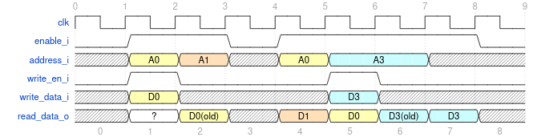
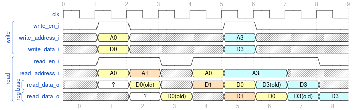

==========
RAM blocks
==========

Various RAM blocks are available.

Choosing a RAM
==============

For a memory with one write port and one read port on one clock,
`ram_auto`_ is the RAM new code should instantiate.  It keeps a small
memory in LUT RAM and a larger one in block RAM, picking at
elaboration from the LUT RAM the target has (see
``nsl_hwconfig.memory_config``) and the memory's size:

- LUT RAM if the target has LUT RAM with an asynchronous read port and
  the memory takes at most ``lutram_primitives_max_c`` of its
  primitives, ``ceil(words / depth) * ceil(width / width)`` for the
  primitive geometry the target reports.  The default,
  ``ram_auto_lutram_primitives_max_c``, is 16: 1 kbit of Gowin SSRAM
  or Lattice DPR16X4, 3 kbit of Xilinx RAM32M;

- block RAM otherwise, through `ram_2p_homogeneous`_.

Setting ``lutram_primitives_max_c`` to zero forces block RAM, a large
value LUT RAM where the target has some.  The rule is available as
``ram_auto_implementation()`` for code or tests that need to know the
outcome.

Read latency is the same whatever the implementation, the one of
`ram_2p_r_w`_ with the same ``registered_output_c``: one cycle, or
two with the registered output.  The LUT RAM implementation reads its
array asynchronously and registers the result once or twice to match.
Words may be split in lanes, each with its own write enable.  Reading
a word on the edge it is written returns undefined data.

On Gowin, the LUT RAM implementation carries a ``syn_ramstyle``
attribute: without it, Gowin synthesis moves arrays of 32 words or
more to block RAM whenever a register sits next to them.  Block RAM
lanes take one BSRAM each there, however shallow the memory.

.. _ram_auto:

.. vhdl:autocomponent:: nsl_memory.ram.ram_auto

Single-port single word RAM
===========================

`ram_1p`_ is a small and easy RAM with one port, on every cycle with
``enable=1``, output is read from memory targetted by address, optionally,
memory at address can be written.

.. _ram_1p:

.. vhdl:autocomponent:: nsl_memory.ram.ram_1p

Single-port multiple-word RAM
=============================

`ram_1p_multi`_, is basically the same as
`ram_1p` but has a concept of words and write masks. Data interface
is a group of `data_word_count_c` each of width `word_size_c`. There
are `data_word_count_c` write enable inputs for
`data_word_count_c*word_size_c` input data bits.

.. _ram_1p_multi:

.. vhdl:autocomponent:: nsl_memory.ram.ram_1p_multi

Dual-port RAM, one write, one read
==================================

`ram_2p_r_w`_, is a little more complicated. It has two ports, one
write only, the other read only.  With generic ``registered_output_c``
set to ``false``, it has the same timing characteristics as `ram_1p`_.

Additionally, this module may have two clocks rather than one, one for
each port.

   "reg" and "base" lines refer to whether regsitered_output_c is
   enabled or not, respectively.

.. _ram_2p_r_w:

.. vhdl:autocomponent:: nsl_memory.ram.ram_2p_r_w

Dual-port, multi-word RAM
=========================

`ram_2p_homogeneous`_, like `ram_1p_multi`_, has concept of words with
discrete enables, but both ports may read and write.  Read timings
match those of `ram_1p_multi`_ and the same ``registered_output_c``
generic is available.  This module has one clock for each port.

.. _ram_2p_homogeneous:

.. vhdl:autocomponent:: nsl_memory.ram.ram_2p_homogeneous

General dual-port byte RAM
==========================

`ram_2p`_, is a byte-based ram where input aspect ratio and output
aspect ratio may not be the same.  This can act as a backing storage
for a width changing fifo.  This module has one clock for each port.

.. _ram_2p:

.. vhdl:autocomponent:: nsl_memory.ram.ram_2p
